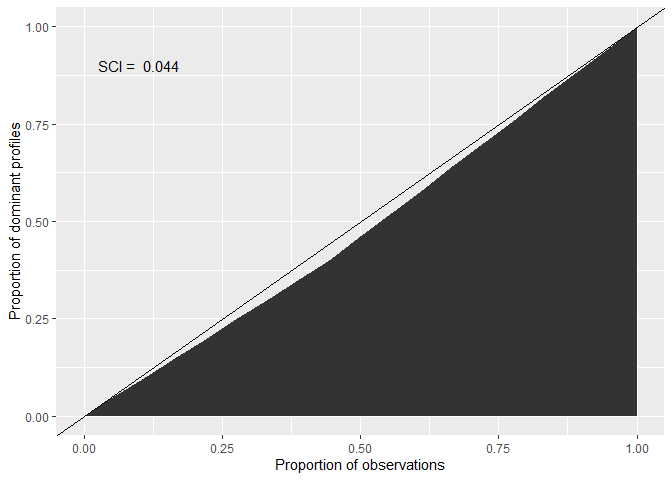
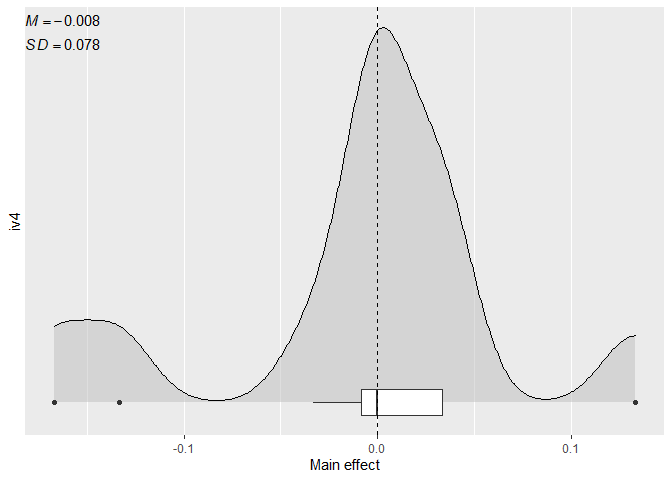

# `cacc`: Conjunctive Analysis of Case Configurations

An R Package to compute Conjunctive Analysis of Case Configurations
(CACC), Situational Clustering Tests, and Main Effects

## Description

This package contains a set of functions to conduct Conjunctive Analysis
of Case Configurations (CACC) (Miethe, Hart & Regoeczi, 2008), to
identify and quantify situational clustering in dominant case
configurations (Hart, 2019), and to determine the main effects of
specific variable values on the probabilities of outcome (Hart, Rennison
& Miethe, 2017). Initially conceived as an exploratory technique for
multivariate analysis of categorical data, CACC has developed to include
formal statistical tests that can be applied in a wide variety of
contexts. This technique allows examining composite profiles of
different units of analysis in an alternative way to variable-oriented
methods.

## Installation

You can install the development version of cacc from
[GitHub](https://github.com/) with:

``` r
# Check if the`devtools` package needs to be installed
if (!require("devtools")) install.package("devtools")

# Install the `cacc` package from GitHub
devtools::install_github("amoneva/cacc")
```

## Examples

``` r
library(cacc)
```

### CACC

``` r
# Calculate the CACC matrix
cacc_matrix <- test_data |> 
  cacc(
    ivs = c(iv1, iv2, iv3, iv4), 
    dv = dv1
  )
#> Joining, by = c("iv1", "iv2", "iv3", "iv4")

# Look at the first few rows
cacc_matrix |> head()
#> # A tibble: 6 × 6
#>     iv1   iv2   iv3   iv4  freq     p
#>   <int> <int> <int> <int> <int> <dbl>
#> 1     0     1     1     0     6 0.333
#> 2     1     0     2     1     6 0.333
#> 3     0     0     0     1     5 0.2  
#> 4     0     1     1     2     5 0.2  
#> 5     1     0     2     0     5 0.2  
#> 6     1     0     2     2     5 0.2
```

### Situational Clustering Tests

``` r
# Compute a Chi-Square Goodness-of-Fit Test
cacc_matrix |> cluster_xsq()
#> 
#>  Chi-squared test for given probabilities
#> 
#> data:  obs
#> X-squared = 0.8, df = 17, p-value = 1
```

``` r
# Compute a Situational Clustering Index (SCI)
cacc_matrix |> cluster_sci()
#> [1] 0.04444444

# Plot a Lorenz Curve to visualize the SCI
cacc_matrix |> plot_sci()
```



### Main Effects

``` r
# Compute the main effects for a specific variable value
cacc_matrix |> 
  main_effect(
    iv = iv4,
    value = 0,
    # Set to `FALSE` for a numeric vector of effects
    summary = TRUE
  )
#> # A tibble: 1 × 5
#>   median   mean    sd    min   max
#>    <dbl>  <dbl> <dbl>  <dbl> <dbl>
#> 1      0 -0.008 0.078 -0.167 0.133

# Plot the distribution of the main effect
cacc_matrix |> 
  plot_effect(
    iv = iv4,
    value = 0
  )
```



## References

-   Hart, T. C. (2019). Identifying Situational Clustering and
    Quantifying Its Magnitude in Dominant Case Configurations: New
    Methods for Conjunctive Analysis. *Crime & Delinquency, 66*(1),
    143-159. <https://doi.org/10.1177/0011128719866123>
-   Hart, T. C., Rennison, C. M., & Miethe, T. D. (2017). Identifying
    Patterns of Situational Clustering and Contextual Variability in
    Criminological Data: An Overview of Conjunctive Analysis of Case
    Configurations. *Journal of Contemporary Criminal Justice, 33*(2),
    112–120. <https://doi.org/10.1177/1043986216689746>
-   Miethe, T. D., Hart, T. C., & Regoeczi, W. C. (2008). The
    Conjunctive Analysis of Case Configurations: An Exploratory Method
    for Discrete Multivariate Analyses of Crime Data. *Journal of
    Quantitative Criminology, 24*, 227–241.
    <https://doi.org/10.1007/s10940-008-9044-8>
